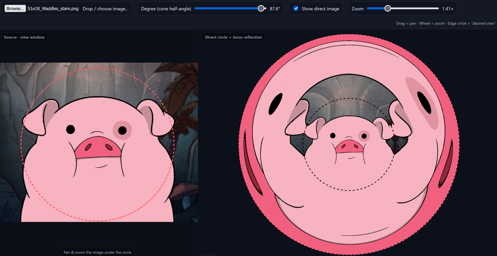

# Anamorph

Two interactive in-browser demos that show what an image looks like reflected in a curved mirror.

**Live:** https://abobabo91.github.io/anamorph/

## Conical mirror
[`conical.html`](conical.html) — adjust the cone half-angle (default 87°).

## Elliptical torus
[`elliptic.html`](elliptic.html) — same idea plus a horizontal-stretch ellipse factor.

Pure client-side HTML/canvas — drop an image, pan/zoom under the selection circle, watch the reflection update.
